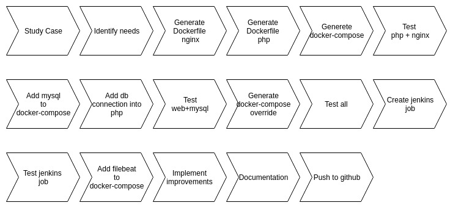

# Document

## Steps to build and test the environment

1- Generate build for all images
```
docker-compose build --no-cache
or
make build
```

2- Run webapp

Verbose run:
```
docker-compose up
or
make up-verbose
```

Not verbose run:
```
docker-compose up -d
or
make up
```

3- Stop webapp
```
docker-compose up -d
or
make up
```

## Diagram outlinnin the acction taken



## Problem and mistakes

- Start trying to create a dockerfile for mysql without needing, being able to use the default image and docker-compose
- Not understanding docker-swarm correctly
- Not correctly ordering the start of the containers, due to dependencies between them