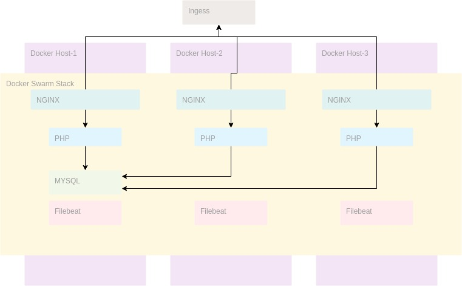

# Docker webapp

This is a case of php web application with nginx and mysql. It also contains a Jenkins job and a Filebeat container to send the logs to ELK-stack.

## Requirementes

1. Docker
2. Docker-compose
3. Docker swarm

## Directory Structure

```
.
├── Code
│   └── public
│       └── index.php
├── Deploy
│   ├── Docker
│   │   ├── beats
│   │   │   ├── Dockerfile
│   │   │   ├── filebeat.yml
│   │   │   └── prospectors.d
│   │   │       └── docker.yml
│   │   └── web
│   │       ├── nginx
│   │       │   ├── Dockerfile
│   │       │   ├── nginx.conf
│   │       │   └── site.conf
│   │       └── php
│   │           └── Dockerfile
│   └── Jenkins
│       ├── common_secrets.txt
│       ├── docker-compose.prod.yml
│       └── Jenkinsfile
├── docker-compose.override.yml
├── docker-compose.yml
├── DOCS
│   ├── Action_diagram.jpg
│   ├── Document.md
│   └── ResponseAnswers.md
├── dumps
├── infrastructure.jpg
├── logs
│   ├── mysql
│   └── nginx
│       ├── access.log
│       └── error.log
├── Makefile
└── README.md
```

## Architecture



## Documentation

* [Document](DOCS/Document.md)
* [ResponseAnswers](DOCS/ResponseAnswers.md)

## Development

### Execute into development environment

Use make file for develope into development environment or use docker-compose

```
make up
```

or

```
make up-verbose
```

or

```
docker-compose up -f docker-compose.yml -f docker-compose.dev.yml
```
